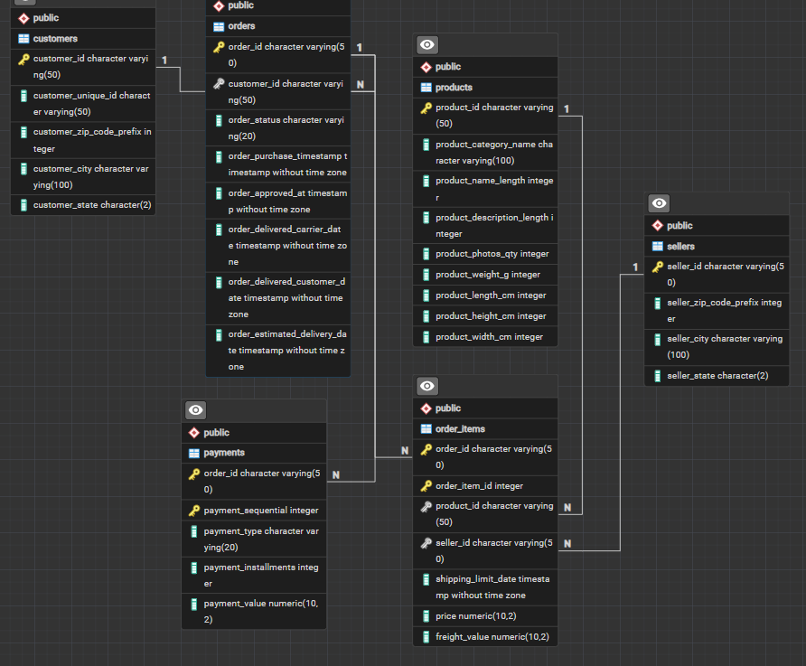

# Commerce_DA

### SQL Analysis of the Olist Brazilian E-Commerce Dataset using PostgreSQL

Commerce_DA is a SQL portfolio project built using the Olist Brazilian E-Commerce dataset. The project focuses on analyzing customer behavior, sales, product demand, seller performance, payment trends, and delivery performance using PostgreSQL.

The goal of the project is to solve practical business questions using SQL and turn raw relational data into useful business insights.

---

## Dataset

This project uses the Olist Brazilian E-Commerce Dataset.

**Source:**  
https://www.kaggle.com/datasets/olistbr/brazilian-ecommerce

### Tables Used

- Customers
- Orders
- Order Items
- Products
- Sellers
- Payments

---

## Database Schema

The project uses six related tables connected through primary and foreign key relationships.



---

## Business Questions

The analysis covers questions such as:

- What is the total revenue generated from delivered orders?
- Which product categories have the highest demand?
- Which sellers contribute the most to sales?
- Which customer states have the largest customer base?
- What percentage of customers are repeat buyers?
- What is the average delivery time?
- What percentage of orders arrive later than the estimated delivery date?
- How do monthly order volumes change over time?
- Which payment methods are used most frequently?
- Which customers contribute the highest spending?

---

## SQL Analysis

The project demonstrates practical PostgreSQL skills including:

- Data validation
- Filtering and sorting
- GROUP BY and HAVING
- Aggregate functions
- Multi-table JOINs
- CASE statements
- Window functions
- RANK()
- Date and timestamp functions
- Subqueries
- SQL Views
- Business-oriented analysis

---

## Key Findings

Some of the key findings from the analysis include:

- **R$13.22M** revenue generated from delivered orders, excluding freight.
- **96,096 unique customers** were identified across the dataset.
- Average delivery time was **12.6 days** across **96,470 delivered orders**.
- **8.1%** of delivered orders arrived after the estimated delivery date.
- The overall **repeat purchase rate was 3.12%**.
- **São Paulo (SP)** had the largest customer base, accounting for **41.9%** of unique customers.
- **3 states** were classified as High-tier states based on the customer threshold used in the analysis.
- **cama_mesa_banho** was the highest-demand product category with **11,115 units sold**.

---

## Project Structure

```text
Commerce_DA
│
├── SQL
│   ├── 01_data_check.sql
│   ├── 02_analysis.sql
│   ├── 03_business_queries.sql
│   └── 04_views.sql
│
├── ER_Diagram
│   └── ER_diagram.png
│
├── .gitignore
└── README.md
